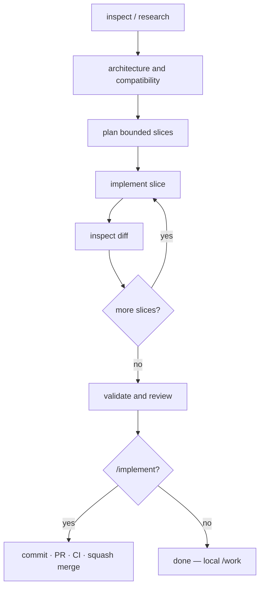

# MAGIC OpenCode

**Research-first multi-agent packs that implement GitHub issues end-to-end — without burning the writer’s step budget on discovery.**

Portable workflows for **[OpenCode](https://opencode.ai)** and **[Cursor](https://cursor.com)**: one operating model, two installable packs.

[](LICENSE)
[](https://github.com/peniakoff/magic-opencode/stargazers)
[](https://github.com/peniakoff/magic-opencode/issues)
[](.opencode/)
[](.cursor/)

---

```text
        ┌─────────────────────────────────────────┐
        │       M A G I C   O P E N C O D E       │
        │   orchestrate · research · implement    │
        └────────────────────┬────────────────────┘
                             │
         inspect / research  │  architecture
                             ▼
                    bounded writer slices
                             │
              only implementer may edit files
                             ▼
              validate → review → (optional)
                   PR · CI · squash merge
```

## Why it feels like magic

Most agent loops fail the same way: the model explores forever, then the write budget is gone.

MAGIC OpenCode **structures** the fix:

| Principle | What you get |
|-----------|--------------|
| **Research before write** | Facts land in an evidence packet *before* the writer runs |
| **One writer role** | Only `implementer` edits the tree; orchestrator never writes |
| **Bounded slices** | Small, write-ready scopes — first edit by tool call 8 |
| **Trusted wrappers** | Constrained `git` / `gh` / deps / format / parallel worktrees |
| **Dual runtime** | Same model in OpenCode *and* Cursor |

## Dual packs

| Runtime | Install surface | Details |
|---------|-----------------|---------|
| **OpenCode** | `opencode.json` + `.opencode/` | Agents, commands, scripts — [pack README](.opencode/README.md) |
| **Cursor** | `.cursor/` only | Skills, agents, scripts — [pack README](.cursor/README.md) |

Copy **one** pack into another repository. They may coexist, but neither calls the other.

## Flow



## Quick start

### OpenCode

1. Copy `opencode.json`, `.opencode/agents/`, `.opencode/commands/`, `.opencode/skills/`, `.opencode/scripts/`, `.opencode/codebase-index.json`, and `.opencode/README.md` into the target repo root.
2. Merge ignore rules:

   ```gitignore
   .artifacts/
   .opencode/index/
   .opencode/worktrees/
   ```

3. Authenticate GitHub CLI (`gh auth login`), start a new OpenCode session, then:

   ```text
   /implement https://github.com/owner/repository/issues/123
   ```

   Local-only loop:

   ```text
   /work <task description>
   ```

Full install checklist: [`.opencode/README.md`](.opencode/README.md).

### Cursor

1. Copy the entire `.cursor/` directory to the target repository root.
2. Merge ignore rules:

   ```gitignore
   .cursor/worktrees/
   .artifacts/
   ```

3. Commit `.cursor/` on trusted `main`, authenticate `gh`, then in Agent chat:

   ```text
   /implement https://github.com/owner/repository/issues/123
   ```

   Local-only:

   ```text
   /work <task description>
   ```

Full install checklist: [`.cursor/README.md`](.cursor/README.md).

## Commands and skills

| Invoke | OpenCode | Cursor | Purpose |
|--------|----------|--------|---------|
| `/implement <issue-url>` | command | skill | Research → slices → validate → review → PR → CI → squash merge |
| `/work <task>` | command | skill | Same loop **without** GitHub delivery |
| `/research` `/design` `/debug` `/review` `/qa` `/security` | commands | via agents | Report-only specialists |

### Cast of agents

| Agent | Role |
|-------|------|
| **orchestrator** | Owns scope, evidence, slicing, validation, delivery (OpenCode primary; Cursor parent chat) |
| **research-explorer** | Repository / API / compatibility facts |
| **architect** | Design across contracts, persistence, security, infra |
| **implementer** | **Only** role allowed to edit files |
| **test-debugger** | Ambiguous failures → repair briefs |
| **reviewer** | Independent final review |
| **security-reviewer** | Trust boundaries |
| **browser-qa** | Exploratory UI checks (Playwright MCP on OpenCode) |

## Safety model

Wrappers under `.opencode/scripts/` and `.cursor/scripts/` are the preferred mutation path. They do **not** stash, reset, force-push, deploy, or publish.

```bash
# examples — run from repository root, no shell chaining
bash .opencode/scripts/github-delivery.sh prepare <issue-url>
bash .cursor/scripts/github-delivery.sh inspect
```

Agent permissions constrain tools; they do **not** sandbox a target repo’s tests or build scripts. For untrusted code, use a dedicated account, container, or disposable VM — see [SECURITY.md](SECURITY.md).

## Documentation

| Doc | Contents |
|-----|----------|
| [`.opencode/README.md`](.opencode/README.md) | OpenCode operating model, MCP, index, parallel worktrees, delivery |
| [`.cursor/README.md`](.cursor/README.md) | Cursor install, orchestrator rules, script discipline |
| [CONTRIBUTING.md](CONTRIBUTING.md) | Dual-pack sync, PR expectations |
| [SECURITY.md](SECURITY.md) | Private vulnerability reporting |
| [CODE_OF_CONDUCT.md](CODE_OF_CONDUCT.md) | Community standards |
| [LICENSE](LICENSE) | MIT |

## License

MIT © [Tomasz Miller](https://github.com/peniakoff)
